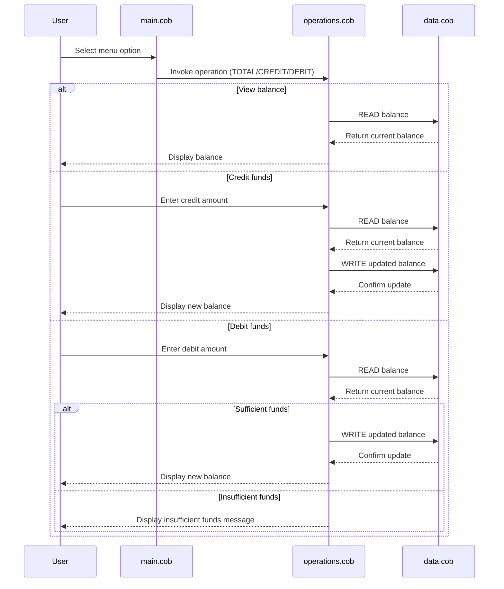

# COBOL Account Management Documentation

This directory documents the legacy COBOL account management sample used in this repository.

## Overview

The application provides a simple interactive menu for managing a single account balance. It supports viewing the current balance, crediting funds, debiting funds, and exiting the program.

## COBOL files

### main.cob
Purpose:
- Serves as the entry point for the application.
- Presents the main menu to the user.
- Routes user input to the operations program.

Key functions:
- Displays the account management menu.
- Accepts the user's choice from 1 to 4.
- Calls the Operations program for balance view, credit, or debit actions.
- Exits the loop when the user selects option 4.

### operations.cob
Purpose:
- Implements the business actions for the account management system.
- Handles balance inquiries, credits, and debits.

Key functions:
- Accepts an operation code such as TOTAL, CREDIT, or DEBIT.
- Reads the current balance from the data program.
- Credits funds by adding an entered amount to the balance.
- Debits funds by subtracting an entered amount from the balance.
- Prevents negative balances by rejecting debits that exceed the available funds.

### data.cob
Purpose:
- Stores and retrieves the account balance.
- Acts as the simple persistence layer for the application.

Key functions:
- Supports READ operations by returning the stored balance.
- Supports WRITE operations by updating the stored balance.

## Business rules related to student accounts

The current implementation reflects a small set of business rules:

- The account starts with an initial balance of 1000.00.
- The user can view the current balance at any time.
- Credits increase the balance by the amount entered.
- Debits decrease the balance by the amount entered.
- A debit is only allowed when the available balance is greater than or equal to the requested amount.
- If the debit amount exceeds the balance, the program displays an insufficient funds message and does not complete the transaction.

## Notes

This sample is intentionally simple and uses a single in-memory balance value rather than a real database or persistent storage system.

## Sequence Diagram

